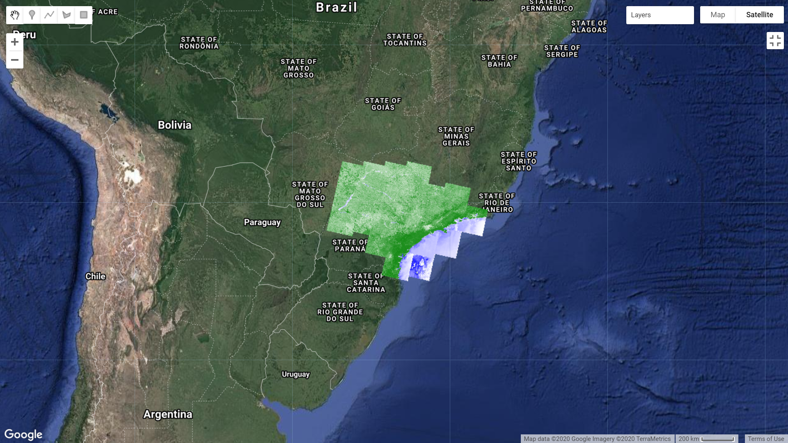
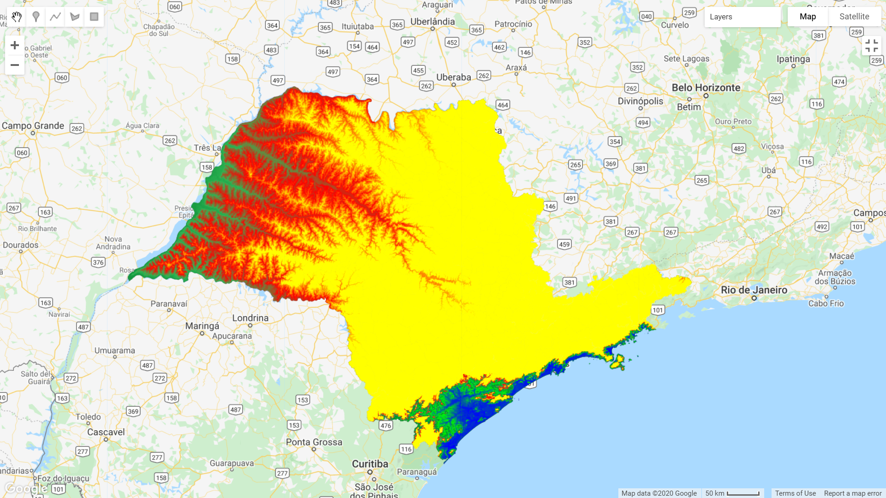

# denchikzika
I am currently working on this project "Spatio-temporal dynamics of arboviral diseases in Brazil in a changing climate". The objective of the project is to (i) use the spatio-temporal methods under Bayesian framework for investigating the relationships among climate, environmental exposures and diseases (i.e. Dengue, Chikungunya and Zika virus); and
(ii) predict the risk of outbreak at municipality level with quantified uncertainties for vector control in a timely and efficient manner. 

## Satellite imagery via Google Earth Engine
One of the main tasks is to process satellite imagery via Google Earth Engine, accommodating spatial misalignment among the disease, climate and environmental data. 

### Normalized Difference Vegetation Index (NDVI)
Normalized difference vegetation index (NDVI) can reflect the greeness of the biome. This could be a possible indicator for the breeding habitats of vector mosquito larvae. This Javascript creates a visualisation of NDVI cloud-free image of Sao Paulo state, Brazil, in 2019 from USGS Landsat 8 Surface Reflectance Tier 1 on Google Earth Engine platform. Details of the data source can be found at https://developers.google.com/earth-engine/datasets/catalog/LANDSAT_LC08_C01_T1_SR. 

```
// Took reference from the code at stackExchange https://gis.stackexchange.com/questions/282971/cloud-mask-using-pixel-qa
// Brazil municaipality shapefile                  
var brazil = ee.FeatureCollection('users/enochsuen26/brazil2010r');

// use the inspector tool to find the São Paulo state -> 645 municipality
// no new municipal btw 2010 and 2015
var muni = brazil.filterMetadata('estado_id', 'equals', '26');

//load images for composite
var collection= ee.ImageCollection('LANDSAT/LC08/C01/T1_SR')
.filterBounds(muni)
.filterDate('2019-01-01','2019-12-31').sort('CLOUD_COVER',false);

// Temporally composite the images with a maximum value function.
var visParams = {bands: ['B4', 'B3', 'B2'], min:0, max: 1000};
Map.centerObject(muni, 5);
Map.addLayer(collection, visParams, 'max value composite');

var getQABits = function(image, start, end, newName) {
    // Compute the bits we need to extract.
    var pattern = 0;
    for (var i = start; i <= end; i++) {
       pattern += Math.pow(2, i);
    }
    // Return a single band image of the extracted QA bits, giving the band
    // a new name.
    return image.select([0], [newName])
                  .bitwiseAnd(pattern)
                  .rightShift(start);
};

// A function to mask out cloudy pixels.
var cloud_shadows = function(image) {
  // Select the QA band.
  var QA = image.select(['pixel_qa']);
  // Get the internal_cloud_algorithm_flag bit.
  return getQABits(QA, 3,3, 'cloud_shadows').eq(0);
  // Return an image masking out cloudy areas.
};

// A function to mask out cloudy pixels.
var clouds = function(image) {
  // Select the QA band.
  var QA = image.select(['pixel_qa']);
  // Get the internal_cloud_algorithm_flag bit(Bit 5).
  return getQABits(QA, 5,5, 'Cloud').eq(0);
  // Return an image masking out cloudy areas.
};

var maskClouds = function(image) {
  var cs = cloud_shadows(image);
  var c = clouds(image);
  image = image.updateMask(cs);
  return image.updateMask(c);
};

var NDVI = function(image) {
  return image.normalizedDifference(['B5', 'B4']).rename('NDVI');
};

var composite_free = collection.map(maskClouds);
var ndvi = collection.map(maskClouds).map(NDVI);
print(ndvi.limit(20))

// set the map view and zoom level
Map.centerObject(muni,5);
Map.addLayer(composite_free, visParams, 'composite collection without clouds');
Map.addLayer(ndvi,{min: -1, max: 1, palette: ['blue', 'white', 'green']}, 'NDVI cloud free'); 

```


## Elevation

Elevation can be linked to the habitats of the mosquitoes. This Javascript can visualise the elevation in Sao Paulo state and export as csv file to Google Drive. 
(Source of data: NASA SRTM Digital Elevation 30m https://developers.google.com/earth-engine/datasets/catalog/USGS_SRTMGL1_003)
```
// brazil municaipality shapefile                  
var brazil = ee.FeatureCollection('users/enochsuen26/brazil2010r');

// use the inspector tool to find the São Paulo state -> 645 municipality
// no new municipal btw 2010 and 2015
var muni = brazil.filterMetadata('estado_id', 'equals', '26');

var dataset = ee.Image('USGS/SRTMGL1_003');
var elevation = dataset.select('elevation');

// Finding Max and Min elevation value 
// 
var maxReducer = ee.Reducer.max();
var theMax = elevation.reduceRegion({
  reducer: maxReducer, 
  geometry: muni, 
  maxPixels: 1e9});
print(theMax);
// 2792

var minReducer = ee.Reducer.min();
var theMin = elevation.reduceRegion({
  reducer: minReducer, 
  geometry: muni, 
  maxPixels: 1e9});
print(theMin);
// -50

// Visualisation 
var slope = ee.Terrain.slope(elevation.clip(muni));
Map.centerObject(muni, 5)
Map.addLayer(slope, {min: 0, max: 60}, 'slope');
var visualization_params = {min: -50, max: 1000, palette:['000000',"ffffff"]};
Map.addLayer(elevation.clip(muni), visualization_params, 'elevation');

/////////////////////////////////////////////////////////////////////////////
// https://developers.google.com/earth-engine/image_visualization
// Define an SLD style of discrete intervals to apply to the image.
var sld_intervals =
  '<RasterSymbolizer>' +
    '<ColorMap  type="intervals" extended="false" >' +
      '<ColorMapEntry color="#0000ff" quantity="0" label="0"/>' +            // blue
      '<ColorMapEntry color="#00ff00" quantity="100" label="1-100" />' +     // light green
      '<ColorMapEntry color="#007f30" quantity="200" label="110-200" />' +   // dark green
      '<ColorMapEntry color="#30b855" quantity="300" label="210-300" />' +   // green
      '<ColorMapEntry color="#ff0000" quantity="400" label="310-400" />' +   // red
      '<ColorMapEntry color="#ffff00" quantity="1000" label="410-1000" />' + // yellow
    '</ColorMap>' +
  '</RasterSymbolizer>';

// Define an sld style color ramp to apply to the image.
var sld_ramp =
  '<RasterSymbolizer>' +
    '<ColorMap type="ramp" extended="false" >' +
      '<ColorMapEntry color="#0000ff" quantity="0" label="0"/>' +
      '<ColorMapEntry color="#00ff00" quantity="100" label="100" />' +
      '<ColorMapEntry color="#007f30" quantity="200" label="200" />' +
      '<ColorMapEntry color="#30b855" quantity="300" label="300" />' +
      '<ColorMapEntry color="#ff0000" quantity="400" label="400" />' +
      '<ColorMapEntry color="#ffff00" quantity="500" label="500" />' +
    '</ColorMap>' +
  '</RasterSymbolizer>';

// Add the image to the map using both the color ramp and interval schemes.
Map.addLayer(elevation.clip(muni).sldStyle(sld_intervals), {}, 'SLD intervals');
Map.addLayer(elevation.clip(muni).sldStyle(sld_ramp), {}, 'SLD ramp');
/////////////////////////////////////////////////////////////////////////////

//////////////////////////////////////////////////////////////////////////////////
// Elevation per each municipal
//////////////////////////////////////////////////////////////////////////////////
var reduced = elevation.reduceRegions({
    collection: muni , 
    reducer:ee.Reducer.mean(), 
    scale: 30
  });
print(reduced)


// Export the data to a table for further analysis
Export.table.toDrive({
  collection:reduced,
  description: 'SRTM_DEM_SP',
  folder: "GEE",
  fileFormat:"CSV",
})

```


## Climate Data 

Climate data is crucial in affecting mosquitoes behaviour. ERA5 Daily aggregates data (https://developers.google.com/earth-engine/datasets/catalog/ECMWF_ERA5_DAILY) is a good source of climate data. This Javascript can export the total precipitation data as a csv file to the Google Drive for further analysis. 

```
// select total precipitation from ERA5 
var era5_tp = ee.ImageCollection('ECMWF/ERA5/DAILY')
                  .select('total_precipitation')
                  .filter(ee.Filter.date('2015-01-01', '2019-12-31'));

// brazil municaipality shapefile                  
var brazil = ee.FeatureCollection('users/enochsuen26/brazil2010r');

// use the inspector tool to find the São Paulo state -> 645 municipality
// no new municipal btw 2010 and 2015
var muni = brazil.filterMetadata('estado_id', 'equals', '26');
print(muni);

// see https://gis.stackexchange.com/questions/274569/exporting-table-in-to-a-drive-from-google-earth-engine-returns-blank-rows
// Load the first image of the collection
var era5_first = ee.Image(era5_tp.first());
print(era5_first,'era5_first');

// Load the scale of the image
var era5_scale = era5_first.projection().nominalScale();

//https://developers.google.com/earth-engine/reducers_reduce_region
// Combine the mean and standard deviation reducers.
var reducers = ee.Reducer.mean().combine({
  reducer2: ee.Reducer.stdDev(),
  sharedInputs: true
});

var muni_tp = era5_tp.map(function(img) {
  return img.reduceRegions({
      collection: muni,
      reducer: reducers,
      scale: era5_scale
    }).map(function(f){
        return f.set('date', img.date());
    });
}).flatten()

print(muni_tp.limit(20))

// Export csv file to Google Drive
Export.table.toDrive({
    collection:muni_tp,
    description: 'ERA5_daily_SP_2015_2019_dew',
    folder: "GEE",
    selectors:(["cod_6","nome","uf"," date",
                "mean", "stdDev"
                ]),
    fileFormat: 'CSV'
    });
```
